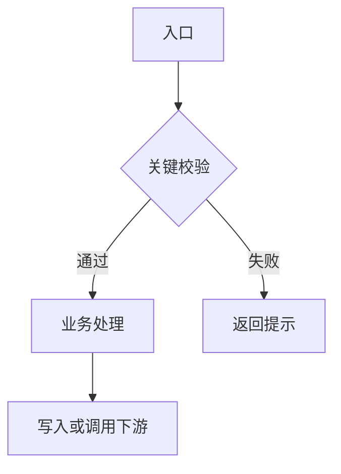

# [业务名称] 业务逻辑说明

> 用途：记录一个业务功能的完整来源、调用链、数据变化和维护边界。本文档应与代码一起维护。
>
> 文档状态：草稿 / 已核对 / 已上线  
> 业务负责人：[姓名或部门]  
> 技术负责人：[姓名]  
> 首次整理：[YYYY-MM-DD]  
> 最后核对：[YYYY-MM-DD]  
> 适用版本、分支或 SVN 版本：[填写]  
> 关联工单或需求：[填写]

## 1. 功能定位和范围

### 1.1 功能解决什么问题

[用业务人员能看懂的话说明目标、使用场景和最终产出。]

### 1.2 本文档包含什么

- [包含的页面、接口、任务、表、视图或流程]

### 1.3 本文档不包含什么

- [相似但不同的旧系统、旧接口、历史流程或其他租户逻辑]

如果新旧功能名称相同，必须写清楚它们的入口和表是否相同，避免维护时误改另一套流程。

## 2. 项目和代码入口

| 项目 | 文件或目录 | 作用 | 备注 |
|---|---|---|---|
| 后端 | `[绝对路径或仓库相对路径]` | `[Controller/Service/DAO/任务等]` | `[分支或版本]` |
| 前端 | `[绝对路径或仓库相对路径]` | `[页面/组件/请求入口]` | `[菜单或路由]` |
| 数据库 | `[实例/Schema]` | `[表/视图/过程/触发器]` | `[环境]` |
| 其他 | `[项目或服务]` | `[MQ/文件/外部系统]` | `[连接或权限说明]` |

### 2.1 页面和按钮映射

| 页面 | 按钮或事件 | 前端方法 | 请求方式和接口 | 后端入口 |
|---|---|---|---|---|
| `[页面路径]` | `[按钮名称]` | `[methodName()]` | `[POST /xxx]` | `[Controller -> Service]` |

## 3. 参与角色、权限和数据范围

| 角色或账号 | 可以做什么 | 数据范围 | 权限来源 | 关键校验 |
|---|---|---|---|---|
| `[角色]` | `[查询/新增/审核/导出]` | `[单位、租户、区域、船舶等]` | `[菜单、注解、代码条件]` | `[条件]` |

说明以下内容：

- 登录用户、单位、租户或组织从哪里取得。
- Controller、Service、SQL 是否再次校验权限和数据范围。
- 是否存在管理员绕过、跨单位查询或按用户自动补充条件。
- 导出、详情、批量操作是否和列表查询使用相同范围。

## 4. 所有数据来源和触发入口

这一节必须逐项填写。没有确认的来源写“待确认”，不能假设“只有页面按钮会改数据”。

| 来源类型 | 名称或对象 | 位置 | 什么时候触发 | 输入 | 直接写入或产生 | 负责人/环境 | 证据或核对状态 |
|---|---|---|---|---|---|---|---|
| 页面操作 | `[按钮/表单]` | `[前端路径和方法]` | `[用户动作]` | `[字段]` | `[接口或表]` | `[角色]` | `[已核对/待核对]` |
| HTTP/API | `[接口名称]` | `[Controller/路由]` | `[调用方]` | `[参数]` | `[Service/表]` | `[系统]` | `[证据]` |
| 应用定时任务 | `[任务名]` | `[@Scheduled/Job 类]` | `[Cron/间隔/时区]` | `[查询条件]` | `[更新或发送]` | `[服务环境]` | `[证据]` |
| 数据库定时任务 | `[JOB/SCHEDULER 名称]` | `[Schema/脚本]` | `[Cron/间隔/启用状态]` | `[过程参数]` | `[表/过程]` | `[数据库环境]` | `[证据]` |
| 数据库触发器 | `[触发器名]` | `[表和 Schema]` | `[INSERT/UPDATE/DELETE 时机]` | `[OLD/NEW 字段]` | `[被更新表或字段]` | `[数据库环境]` | `[证据]` |
| MQ/事件 | `[Exchange/Queue/Topic]` | `[生产者/消费者]` | `[事件名称]` | `[消息体]` | `[消费副作用]` | `[服务]` | `[证据]` |
| 批量/文件 | `[文件或导入任务]` | `[路径/接口]` | `[上传或批处理时间]` | `[文件字段]` | `[表或接口]` | `[操作人]` | `[证据]` |
| 外部系统 | `[系统名称]` | `[客户端/URL/服务]` | `[调用条件]` | `[请求]` | `[响应或回写]` | `[对方系统]` | `[证据]` |
| 手工操作 | `[SQL/后台菜单]` | `[脚本或菜单]` | `[何时使用]` | `[条件]` | `[数据变化]` | `[授权人]` | `[证据]` |

### 4.1 数据来源核对清单

- [ ] 已搜索应用代码中的 `@Scheduled`、Quartz、Job、批处理入口。
- [ ] 已向数据库管理员确认 `DBMS_SCHEDULER`、`DBMS_JOB`、存储过程和启用状态。
- [ ] 已查询相关表的触发器、触发时机、`OLD/NEW` 使用和级联更新。
- [ ] 已检查视图、物化视图、同义词、存储过程和跨库 DB Link。
- [ ] 已检查 MQ、WebSocket、回调、文件导入和外部接口。
- [ ] 已询问是否存在生产环境手工 SQL、补数脚本或后台修复操作。

## 5. 业务数据模型

### 5.1 主表和关联对象

| 对象 | 类型 | 主键或关联键 | 用途 | 读/写 |
|---|---|---|---|---|
| `[TABLE_NAME]` | `[表/视图]` | `[ID/关联字段]` | `[业务含义]` | `[读/写]` |

### 5.2 字段语义

| 字段 | 中文含义 | 谁产生 | 谁可以修改 | 什么时候变化 | 空值或默认值 | 下游用途 |
|---|---|---|---|---|---|---|
| `[FIELD]` | `[含义]` | `[入口]` | `[角色/接口]` | `[时机]` | `[规则]` | `[报表/结算/任务]` |

不要只记录字段名和中文名，还要写清楚“哪个动作会改它”和“哪个下游会依赖它”。

## 6. 端到端流程

### 6.1 主流程

```text
[入口]
  -> [校验]
  -> [写入或调用]
  -> [下一状态]
  -> [下游动作]
```

### 6.1.1 简单流程图（可选）

默认画一张 5～12 个节点的 Mermaid 主流程图，只表达已经有代码、SQL、配置或业务证据支持的路径。复杂功能拆成多张图；无法确认的节点标为“待确认”，不要根据经验补全。



如果证据不足，保留“流程图待确认”并在第 12 节列出需要补充的文件、SQL、任务或业务规则。

### 6.2 分支、驳回和重试

| 触发条件 | 分支动作 | 状态或数据变化 | 是否可重试 | 重试风险 |
|---|---|---|---|---|
| `[条件]` | `[动作]` | `[变化]` | `[是/否]` | `[重复写入/重复扣费等]` |

### 6.3 状态流转

| 状态值 | 页面名称 | 进入动作 | 可进入的下一状态 | 驳回或异常回到哪里 |
|---:|---|---|---|---|
| `[值]` | `[名称]` | `[接口/任务]` | `[值]` | `[值]` |

## 7. 接口调用链和写入路径

### 7.1 接口调用链

| 接口 | Controller | Service | DAO/Mapper/SQL | 事务边界 | 主要副作用 |
|---|---|---|---|---|---|
| `[METHOD /path]` | `[类.方法]` | `[类.方法]` | `[方法/XML/存储过程]` | `[事务说明]` | `[表、消息、文件]` |

### 7.2 所有写入路径

同一个关键字段必须集中列出所有写入者，不能只记录本次修改的接口。

| 表.字段 | 写入入口 | 写入条件 | 新值来源 | 是否覆盖历史值 | 是否有校验 |
|---|---|---|---|---|---|
| `[TABLE.FIELD]` | `[接口/任务/触发器/脚本]` | `[条件]` | `[参数/查询/计算]` | `[是/否]` | `[校验位置]` |

## 8. 业务规则和不变量

用可以验证的条件描述规则，不写“正常处理”“按业务要求处理”这类无法检查的描述。

| 编号 | 规则 | 校验位置 | 失败提示或处理 | 是否数据库也保护 |
|---|---|---|---|---|
| R-001 | `[可验证规则]` | `[前端/Controller/Service/DB]` | `[提示/回滚/忽略]` | `[是/否/待确认]` |

同时记录：

- 数值边界、时间范围、空值和重复提交规则。
- 首次、二次、补录、历史数据的区别。
- 是否允许修改已下发、已审核或已结算数据。
- 并发、幂等、顺序和事务失败时的行为。

## 9. 下游影响

| 下游功能 | 读取对象或字段 | 依赖条件 | 影响 |
|---|---|---|---|
| `[报表/结算/通知/接口]` | `[表/字段/视图]` | `[状态或时间条件]` | `[会产生什么结果]` |

必须检查列表、详情、导出、统计、结算、通知、缓存、搜索索引和外部同步是否读取同一数据。

## 10. 配置、部署和环境依赖

| 依赖 | 位置 | 开发环境 | 测试环境 | 生产环境 | 核对方式 |
|---|---|---|---|---|---|
| 数据库字段/权限 | `[DDL/Schema]` | `[状态]` | `[状态]` | `[状态]` | `[SQL/管理员确认]` |
| 定时任务开关 | `[配置项]` | `[值]` | `[值]` | `[值]` | `[配置检查]` |
| 菜单和按钮 | `[菜单配置]` | `[状态]` | `[状态]` | `[状态]` | `[页面验证]` |
| MQ/外部服务 | `[配置项]` | `[地址]` | `[地址]` | `[地址]` | `[连通性]` |

不要在本文档写密码、Token、私钥或完整连接凭据；只记录配置名、所在文件和核对方法。

## 11. 验证证据

| 检查项目 | 命令、SQL 或操作 | 环境 | 时间 | 结果 | 未覆盖内容 |
|---|---|---|---|---|---|
| 编译/静态检查 | `[命令]` | `[本地]` | `[时间]` | `[结果]` | `[内容]` |
| 接口验证 | `[请求或页面操作]` | `[环境]` | `[时间]` | `[结果]` | `[内容]` |
| 数据库验证 | `[SQL/触发器/任务检查]` | `[环境]` | `[时间]` | `[结果]` | `[内容]` |
| 浏览器验证 | `[页面和场景]` | `[环境]` | `[时间]` | `[结果]` | `[内容]` |
| 部署验证 | `[版本/日志/回滚点]` | `[环境]` | `[时间]` | `[结果]` | `[内容]` |

明确区分“本地代码已验证”和“需要 Oracle、浏览器、部署环境或业务人员确认”。

## 12. 已知边界和待确认项

### 已知边界

- `[当前代码明确存在但未修改的行为]`

### 待确认项

- `[需要业务负责人确认的规则]`

### 不能自行推断的内容

- `[例如责任人、状态含义、历史数据是否补转换、跨租户范围]`

## 13. 变更记录

| 日期 | 修改人 | 变更内容 | 关联代码或需求 | 是否影响历史数据 |
|---|---|---|---|---|
| `[YYYY-MM-DD]` | `[姓名]` | `[内容]` | `[路径/工单]` | `[是/否]` |

## 14. 后续维护检查顺序

1. 先确认修改的是入口、状态、字段、下游还是配置。
2. 搜索所有读写该字段、接口和状态的代码。
3. 查应用定时任务、数据库定时任务、触发器、视图、存储过程和手工脚本。
4. 核对权限、租户/单位范围、事务和并发行为。
5. 修改后更新本文档的入口、写入路径、规则、边界和验证证据。

## 15. 请需求提供方补充的信息

如果功能来自多人维护或历史系统，开始分析前请尽量提供：

- 涉及的前端页面、后端接口、数据库表或业务名称。
- 所有已知的定时任务、数据库 Job、触发器、存储过程和视图。
- 哪些角色操作，是否存在单位、租户、区域或船舶范围限制。
- 哪些字段是计划值、实际值、确认值、计算值或历史快照。
- 是否允许修改历史数据、已审核数据、已结算数据。
- 是否有 MQ、外部系统、文件导入、手工 SQL 或生产补数脚本。
- 现有异常案例、报错信息、日志关键字和可以验证的测试数据。
- 本次需求明确要改变的规则，以及明确不能改变的历史行为。


